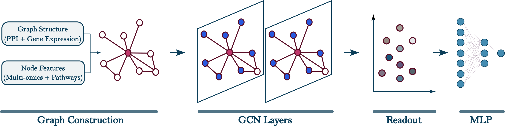

# Cancer Driver Gene Prediction using Graph Neural Networks

This repository contains the code, data, and models for our paper:

**“Effective Integration and Intensive Pretraining of Graph Neural Networks for Accurate Cancer Driver Gene Prediction”**  

##  Overview

We propose a novel graph-based framework for cancer driver gene prediction, leveraging multi-omics features, biological pathways, and gene expression–derived coexpression graphs. Our method integrates heterogeneous biological signals into a Graph Neural Network (GNN) and applies a two-stage pretraining strategy to improve generalization.

  

The pipeline consists of:
- **Graph Construction**: PPI + Gene Expression-based coexpression network  
- **Node Features**: Integrated multi-omics and pathway annotations  
- **GCN Layers**: Message passing and node embedding  
- **Readout**: Extract node-level features  
- **MLP**: Final classification layer

Although not shown in the figure, we also introduce a cancer-agnostic pretraining phase to initialize model weights. This initialization helps improve generalization, especially in cancers with limited labeled data, and enables the model to transfer knowledge across cancer types.

##  Key Features

- Multi-omics feature integration (mutation, expression, methylation, CNA)  
- Pathway-based node features from KEGG  
- Cancer-type–specific graph construction using gene coexpression data derived from TCGA expression profiles  
- Two-stage pretraining: unsupervised pretraining + fine-tuning  
 

##  Repository Structure
data/ – Directory containing preprocessed input datasets used for model training

network_preprocessing/ – Code and scripts for graph construction

Supplementary.pdf – Supplementary document detailing methodology and results

gcn_no_pretrain.ipynb – Jupyter notebook for training the GCN model without pretraining

gcn_pretrain_finetune.ipynb – Jupyter notebook for training the GCN model with pretraining and fine-tuning

README.md – Project overview and usage instructions

